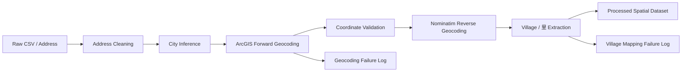

# Geospatial ETL Pipeline for Taiwan Address Data

A portfolio-ready Python pipeline that converts raw Taiwanese address records into structured, spatial-analysis-ready data.

The project originated from a research preprocessing workflow for real-estate transaction and point-of-interest data. It handles address normalization, forward geocoding, coordinate validation, reverse geocoding, village-level enrichment, caching, rate control, and traceable failure reporting.

## Problem

Raw datasets often contain only textual addresses. Before spatial modeling, they need reliable coordinates and local administrative attributes.

Real-world address data introduce several issues:

- inconsistent use of `台` / `臺`
- missing city or county information
- floor numbers, parentheses, and other extra text
- successful geocoding but missing village / 里 information
- external API failures or ambiguous matches
- repeated addresses that would otherwise trigger duplicate API requests

This project turns that preprocessing task into a reusable ETL workflow instead of a one-off cleaning script.

## Pipeline



## Key Features

### Address normalization
- truncates unnecessary text after the house number when possible
- removes parenthetical information
- normalizes `台` to `臺` for city / county matching
- infers missing city information from address content or a fallback city

### Forward geocoding
Uses ArcGIS through the `geocoder` package to convert addresses into latitude and longitude.

### Coordinate validation
Rejects coordinates outside an expected Taiwan bounding box before downstream processing.

### Reverse geocoding
Uses OpenStreetMap Nominatim through `geopy` to retrieve:
- standardized reverse-geocoded address
- village / 里 / 村 information when available

### Reliability controls
- in-memory cache for repeated forward-geocoding requests
- in-memory cache for repeated reverse-geocoding requests
- configurable request delays
- row-level exception handling
- separate failure summaries for coordinate and village-resolution failures

## Repository Structure

```text
Geospatial-ETL-Pipeline/
├── README.md
├── requirements.txt
├── .gitignore
├── src/
│   ├── __init__.py
│   └── geospatial_etl.py
├── scripts/
│   └── find_failures.py
├── tests/
│   └── test_address_utils.py
├── data/
│   └── README.md
└── notebooks/
    └── README.md
```

## Installation

```bash
git clone https://github.com/Yiling48/Geospatial-ETL-Pipeline.git
cd Geospatial-ETL-Pipeline

python -m venv .venv
```

Activate the environment and install dependencies:

```bash
pip install -r requirements.txt
```

## Usage

### 1. Process one CSV

Example for a real-estate transaction file:

```bash
python src/geospatial_etl.py \
  --input data/raw/example.csv \
  --output outputs/example_geocoded.csv \
  --addr-col "土地位置建物門牌" \
  --town-col "鄉鎮市區" \
  --target-col "交易標的" \
  --target-exclude "土地"
```

Example for a point-of-interest file that only contains an address column:

```bash
python src/geospatial_etl.py \
  --input data/raw/poi.csv \
  --output outputs/poi_geocoded.csv \
  --addr-col "organizationaddress"
```

Optional arguments include:
- `--fallback-city`
- `--arcgis-sleep`
- `--nominatim-sleep`
- `--failure-dir`

### 2. Scan processed files for unresolved records

```bash
python scripts/find_failures.py \
  --input-dir outputs \
  --output-dir outputs/failures
```

This creates:
- `ALL_geocode_fail.csv`
- `ALL_village_fail.csv`

## Output

The processed dataset preserves the original columns and adds:

| Column | Description |
|---|---|
| `lat` | Latitude from forward geocoding |
| `lng` | Longitude from forward geocoding |
| `nomi_address` | Reverse-geocoded standardized address |
| `里` | Village / 里 / 村 when available |

Failure files retain source and row information so unsuccessful records can be reviewed rather than silently discarded.

## Technical Stack

- Python
- pandas
- geocoder / ArcGIS
- geopy / Nominatim / OpenStreetMap
- Regular expressions
- CSV ETL
- Geospatial data validation

## Skills Demonstrated

- ETL pipeline design
- data cleaning and schema handling
- API integration
- geospatial data engineering
- caching and rate control
- validation and exception handling
- data quality monitoring
- reproducible preprocessing

## Design Notes

The original notebook contained machine-specific Windows paths and multiple exploratory versions of the workflow. This repository refactors the reusable logic into portable scripts with command-line arguments.

The pipeline intentionally keeps failed records visible. A geocoding workflow should not treat an API response as automatically correct; unresolved or out-of-range results need to remain traceable for later review.

## Limitations

- Geocoding quality depends on external services and address completeness.
- Nominatim administrative fields are not perfectly consistent across all locations.
- The Taiwan bounding box is a practical validation rule, not a substitute for detailed GIS boundary validation.
- Public geocoding services have usage policies and rate limits; production-scale workloads should use an appropriate hosted or commercial service.

## Portfolio

This project is part of my Data Analytics & Science portfolio.

[View portfolio in Notion](https://app.notion.com/p/Data-Analytics-Science-Portfolio-160bcf9053b6800198faddd8f6e6a8ab)

---
Maintained by **Yi-Ling Dai**.
